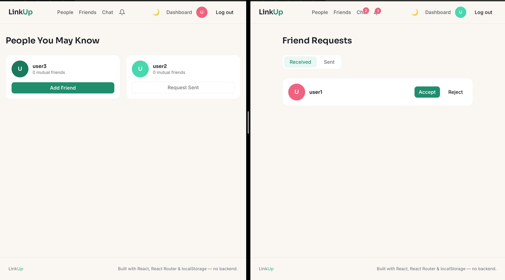
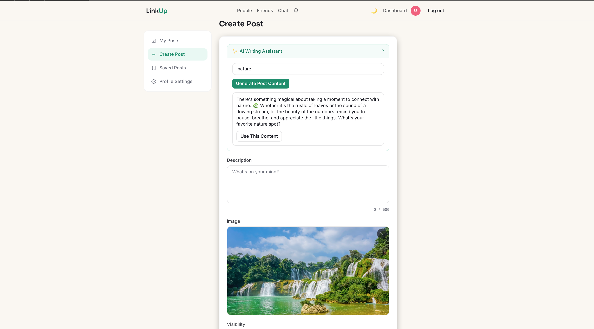
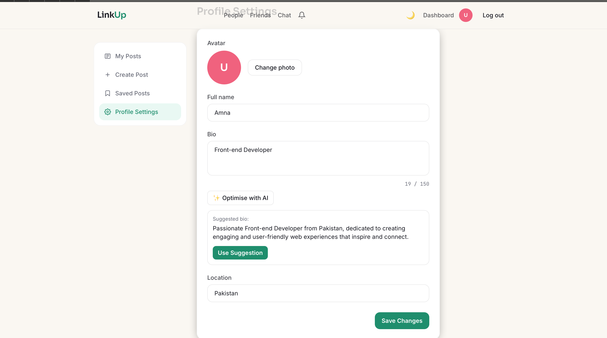
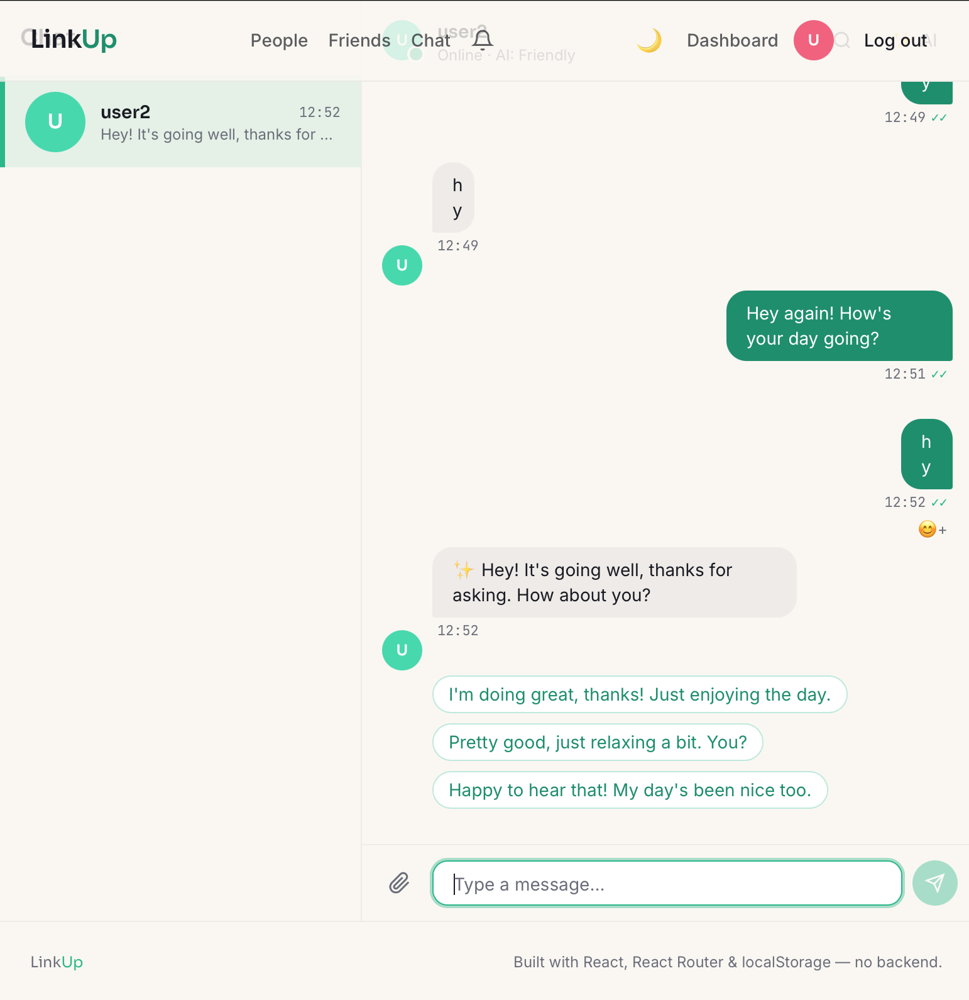

# LinkUp — Social App

LinkUp is a full-featured, frontend-only social networking app built with **React + Vite**. It started as a
core social platform (Assignment 1 — auth, posts, feed, profile) and has now been extended (Assignment 2)
with a **Friend System**, **Real-Time Chat**, and **AI-powered features** using the OpenAI API.

> No backend, no database, no WebSocket libraries. All persistence is handled through the browser's
> `localStorage`, and "real-time" behavior is simulated using the native `storage` event.

---

## 🔗 Video Demo

**[Video Demo](https://youtu.be/wkkGLiyzJVY)** 

---

## Table of Contents

- [Tech Stack](#tech-stack)
- [Screenshots](#screenshots)
- [Assignment 2 — Add-On Features](#assignment-2--add-on-features)
  - [1. Friend System](#1-friend-system)
  - [2. Real-Time Chat](#2-real-time-chat)
  - [3. AI Integration](#3-ai-integration)
- [Real-Time Chat Architecture](#real-time-chat-architecture)
- [localStorage Data Structure](#localstorage-data-structure)
- [Folder Structure](#folder-structure)
- [Getting Started](#getting-started)
- [Setting Up the OpenAI API Key](#setting-up-the-openai-api-key)
- [Notes & Warnings](#notes--warnings)

---

## Tech Stack

| Technology | Purpose |
|---|---|
| React + Vite | Core frontend framework and build tool |
| React Router | Client-side routing, protected routes |
| React Hook Form | Form handling and validation |
| Tailwind CSS | Styling |
| clsx | Conditional class merging |
| OpenAI API (`gpt-4o-mini`) | AI post generation, comment suggestions, profile optimisation, chat replies |
| `localStorage` + `storage` event | Data persistence and real-time chat simulation across browser tabs |
| `FileReader` API | Image/video preview and compression before upload |

---

## Screenshots

All screenshots live in a `/screenshots` folder in the project root, organized by feature. Save your images
using the exact filenames below so they render automatically in this README.

```
public /
└── screenshots/
    ├── people.png
    ├── chat-ai-suggestions-and-autoreply.png
    ├── ai-post-generation.png
    └── ai-profile-optimize.png
```

### Assignment 2 — Friends, Chat & AI

<table>
<tr>
<td width="50%">

**People / Friend Suggestions**


</td>
<td width="50%">

**AI Post Generation**


</td>
</tr>
<tr>
<td width="50%">

**AI Profile Optimisation**


</td>
<td width="50%">

**Chat — AI Suggestions + Auto-Reply**


</td>
</tr>
</table>

> **Tip:** Keep each screenshot under ~500KB (PNG or JPG) so the README stays fast to load on GitHub. If an
> image isn't showing up, double check the filename matches exactly (case-sensitive) and that the file is
> actually pushed to the repo, not just present locally.

---


## Assignment 2 — Add-On Features

Built entirely on top of Assignment 1, without touching its core functionality.

### 1. Friend System

A Facebook-style system for discovering and connecting with other users.

- **People You May Know** (`/people`) — Lists all users who are not already friends and not the current
  user, sorted so that incoming requests appear first, followed by unconnected users, followed by users the
  current user has already sent a request to. Each card shows the correct action button based on
  relationship status: `Add Friend`, `Request Sent` (disabled), or `Accept` / `Reject`.
- **Friend Requests** (`/requests`) — Two tabs, **Received** and **Sent**. Received requests can be
  accepted or rejected; sent requests can be cancelled. Empty states are shown when a tab has nothing to
  display.
- **Friends List** (`/friends`) — Grid of all accepted friends, each with a `Message` button (opens
  `/chat/:userId`) and an `Unfriend` button. Shows a helpful empty state if the user has no friends yet.
- **Profile Page Integration** — The relationship button on any profile page dynamically switches between
  `Add Friend`, `Request Sent`, `Accept` / `Reject`, or `Message` + `Unfriend`, depending on the current
  relationship with that user.
- **Navbar Integration** — A bell icon shows a live badge with the count of pending received friend
  requests (hidden when the count is zero), alongside `People`, `Requests`, `Friends`, and `Chat` links.
- **Mutual Friends Count** *(bonus)* — People suggestion cards show how many mutual friends are shared with
  the current user, calculated by intersecting both users' accepted friend lists.

### 2. Real-Time Chat

A full one-to-one messenger experience, built without any backend or WebSocket library.

- **Chat Home** (`/chat`) — Left sidebar lists all conversations (friends only), sorted by most recent
  message, each showing avatar, name, last message preview, timestamp, and an unread count badge.
- **Chat Conversation** (`/chat/:userId`) — Full messenger UI:
  - Your messages appear on the right in a dark bubble; friend messages appear on the left in a light
    bubble.
  - Text, image, and video messages are all supported — images open in a lightbox on click, videos play
    inline.
  - Auto-resizing textarea input (Enter to send, Shift+Enter for a new line), with an attach button for
    media.
  - Typing indicator (animated dots) while the AI is generating a reply.
  - Auto-scrolls to the latest message.
  - Access is friend-gated — attempting to open a chat with a non-friend redirects to `/friends` with an
    error message.
- **Read Receipts** *(bonus)* — Single tick (✓) when a message is sent/delivered, double tick (✓✓) once the
  recipient has opened the conversation.
- **Emoji Reactions** *(bonus)* — Hovering a message reveals a quick emoji picker; reactions are stored per
  message and shown with a count.
- **Message Search** *(bonus)* — A search icon in the chat header opens an in-conversation search with
  keyword highlighting and a match count.

### 3. AI Integration

Powered by the OpenAI API (`gpt-4o-mini`, capped at `max_tokens: 300` per call) via a single shared client
in `lib/openai.js`.

- **AI Writing Assistant (Post Creation)** — A collapsible panel above the description field on the Create
  Post and Edit Post pages. Closed by default. The user types a short idea, clicks **Generate Post
  Content**, and receives an AI-written post description in a result card with a **Use This Content**
  button. The text is never auto-published — the user can always edit it first.
- **AI Comment Suggestions** — A **✨ Suggest Comment** button on the Post Detail page (visible to logged-in
  users only) reads the post's description and generates a short, relevant comment suggestion that fills
  the comment input. The user still has to click Post to submit it.
- **AI Profile Optimisation** — An **✨ Optimise with AI** button in Profile Settings rewrites the user's bio
  into a more polished, engaging version (under 150 characters), shown as a suggestion the user can accept,
  edit, or ignore.
- **AI Chat — Suggested Replies (always on)** — After a friend sends a message, three short reply
  suggestions appear as clickable chips below their message. Clicking a chip fills the input — it does not
  send automatically. Generated using the last 5 messages of the conversation as context. If this call
  fails, it fails silently (no error shown to the user).
- **AI Chat — Auto-Reply Mode (opt-in only)** — The user can explicitly enable "Let AI reply for me" from
  the chat header's AI dropdown. Once enabled, a banner ("AI is responding on your behalf — tap to
  disable") is shown, and incoming messages are answered automatically after a short, natural delay.
  AI-generated messages are marked with a ✨ sparkle icon so it's always clear what the AI sent. The user can
  still send their own message at any time, and can disable auto-reply by tapping the banner. This setting
  is saved per-user and persists across sessions.
- **AI Chat Personality** *(bonus)* — A personality selector (Friendly / Professional / Casual / Funny) that
  is injected into the AI's system prompt for all chat replies, with the active personality shown in the
  chat header.
- **Error Handling** — Every AI call is wrapped so a failed or timed-out request never crashes the app; it
  shows an inline error (for post/comment/profile generation) or a toast (for auto-reply failures) instead.

---

## Real-Time Chat Architecture

Because this project has no backend, "real-time" messaging is simulated entirely in the browser using the
native `storage` event:

1. When one browser tab writes a new message to `localStorage`, the browser automatically fires a
   `storage` event on **every other tab** open on the same origin (it does **not** fire on the tab that
   made the change).
2. Every chat-related component subscribes to this event inside a `useEffect`:

```js
useEffect(() => {
  function handleStorage(event) {
    if (event.key === 'messages') {
      setMessages(getMessages(currentUser.id, friendId));
    }
    if (event.key === 'messages' || event.key === 'friendRequests') {
      setConversations(getConversations(currentUser.id));
    }
  }
  window.addEventListener('storage', handleStorage);
  return () => window.removeEventListener('storage', handleStorage); // cleanup avoids leaks/stale state
}, [currentUser.id, friendId]);
```

3. This means two users can chat "live" by opening the app in two separate browser tabs (e.g., one normal,
   one Incognito) — no page refresh required.
4. Conversation IDs are generated deterministically so both participants always land on the same thread,
   regardless of who opened it first:

```js
const getConversationId = (userId1, userId2) => [userId1, userId2].sort().join('_');
```

---

## localStorage Data Structure

In addition to the Assignment 1 keys (`users`, `posts`, etc.), Assignment 2 introduces three new keys:

**`friendRequests`**
```json
[
  {
    "id": "req_1703001234",
    "fromUserId": "usr_abc",
    "toUserId": "usr_xyz",
    "status": "pending",
    "sentAt": "2025-01-15T10:00:00Z",
    "respondedAt": null
  }
]
```

**`messages`**
```json
[
  {
    "id": "msg_1703001234",
    "conversationId": "usr_abc_usr_xyz",
    "senderId": "usr_abc",
    "receiverId": "usr_xyz",
    "type": "text",
    "content": "Hey, how are you?",
    "timestamp": "2025-01-15T10:05:00Z",
    "read": false,
    "aiGenerated": false
  }
]
```

**`aiSettings`**
```json
{
  "usr_abc": {
    "aiChatEnabled": false,
    "aiPersonality": "friendly"
  }
}
```

---

## Folder Structure

```
src/
├── components/
│   ├── friends/
│   │   ├── FriendRequestCard.jsx
│   │   ├── FriendCard.jsx
│   │   └── RequestBadge.jsx
│   ├── chat/
│   │   ├── ConversationList.jsx
│   │   ├── ConversationItem.jsx
│   │   ├── MessageBubble.jsx
│   │   ├── MessageInput.jsx
│   │   ├── AISuggestionChips.jsx
│   │   ├── AIChatBanner.jsx
│   │   ├── TypingIndicator.jsx
│   │   └── MediaPreview.jsx
│   └── ai/
│       ├── AIPostAssistant.jsx
│       ├── AICommentSuggest.jsx
│       └── AIProfileOptimize.jsx
├── hooks/
│   ├── useFriends.js
│   ├── useChat.js
│   └── useAI.js
├── lib/
│   └── openai.js
├── pages/
│   ├── PeoplePage.jsx
│   ├── FriendRequestsPage.jsx
│   ├── FriendsPage.jsx
│   └── ChatPage.jsx
└── utils/
    └── friendHelpers.js / chatHelpers.js
```

---

## Getting Started

```bash
# 1. Clone the repo and install dependencies
git clone https://github.com/Amn0805/social-app-AmnaSawar.git
cd social-app
npm install

# 2. Set up your environment variables (see below)

# 3. Run the dev server
npm run dev
```

Open `http://localhost:5173` in your browser. To test the friend system and real-time chat, open the app in
**two separate tabs** (e.g. one normal window, one Incognito/Private window) and log in as two different
users.

---

## Setting Up the OpenAI API Key

AI features require a valid OpenAI API key. Follow these steps:

1. Get an API key from [platform.openai.com](https://platform.openai.com).
2. In the project root (same level as `package.json`, **not** inside `src/`), create a file named `.env`.
3. Add your key to it:
   ```
   VITE_OPENAI_API_KEY=sk-your-key-here
   ```
4. Confirm `.env` is listed in `.gitignore` (it should be, by default).
5. **Restart the dev server** after creating or editing `.env` — Vite only reads environment variables at
   startup:
   ```bash
   # Ctrl+C to stop, then:
   npm run dev
   ```

Without a valid key, all other features (auth, posts, feed, friends, chat) work normally — only the AI
buttons will show an error when clicked.

---


## Notes & Warnings

- The `.env` file is **not committed** to this repository. Anyone cloning this project must add their own
  `VITE_OPENAI_API_KEY` to use the AI features (see [Setting Up the OpenAI API Key](#setting-up-the-openai-api-key)).
- All data lives in `localStorage` — clearing browser storage will reset the app (users, posts, friends,
  messages, everything).
- Real-time chat only works between tabs on the **same browser** and **same origin** (`localhost:5173`).
  It will not sync across different browsers or devices.
- No backend, database, or WebSocket library is used anywhere in this project — this is intentional, per
  the assignment requirements.