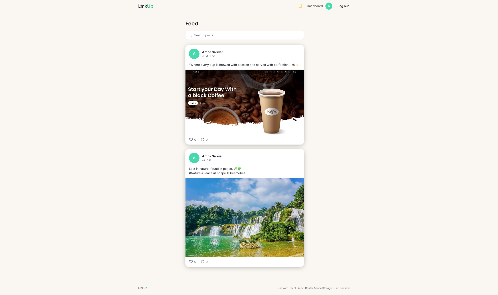
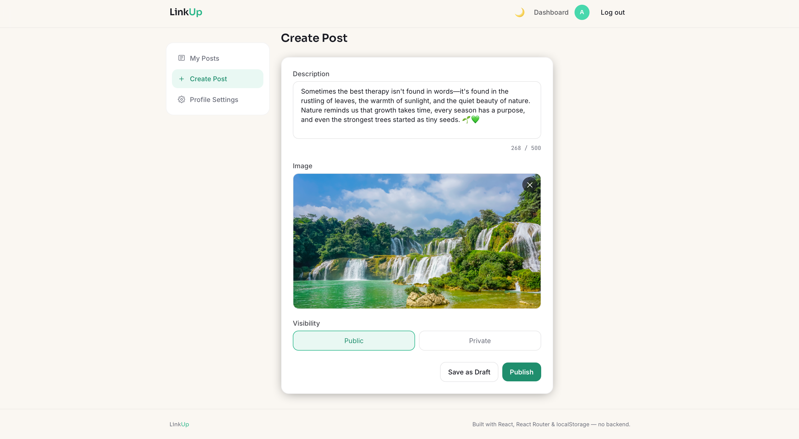
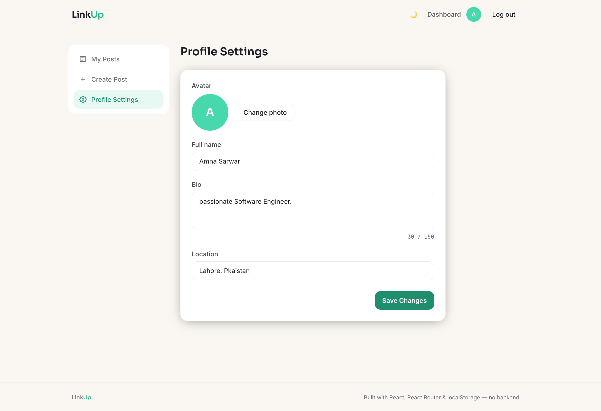
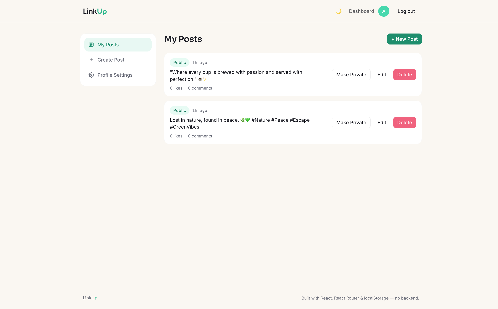

# LinkUp

> A Facebook-inspired social platform built entirely on the frontend — no backend, no database, just React and localStorage doing the heavy lifting.

---

## 🔗 Live Demo

**[https://social-app-amna-sawar.vercel.app](https://social-app-amna-sawar.vercel.app)** 

---

## 📸 Screenshots

| Feed | Create Post |
|---|---|
|  |  |

| Profile | Dashboard |
|---|---|
|  |  |


---

## 🛠️ Tech Stack

| Technology | Purpose |
|---|---|
| **React (Vite)** | Frontend framework and build tooling |
| **React Router v6** | Client-side routing, nested routes, protected routes |
| **Tailwind CSS** | Utility-first styling, dark mode, responsive design |
| **React Hook Form** | Form state, validation (login, signup, post creation, settings) |
| **Context API** | Global auth state (`currentUser`, login/logout/signup) |
| **localStorage** | Full data persistence — users, posts, comments, likes |
| **clsx** | Conditional className composition |
| **React.lazy + Suspense** | Code-splitting — each route loads its own JS chunk on demand |
| **Canvas API** | Client-side image compression before storage (no library — native browser API) |

No backend, no Firebase, no Supabase, no external database, and no UI component libraries — every pixel is custom Tailwind.

---

## ✨ Features

**Auth**
- Signup with full validation (name, email format, password strength, confirm-password match)
- Login with inline error handling, session persists across page refresh
- Protected routes — the dashboard redirects to `/login` if you're not authenticated, and remembers where you were headed

**Feed**
- Public feed of published posts, newest first
- Real-time search by description (no submit button — filters as you type)
- Guests can see Like/Comment buttons but are redirected to login on click

**Posts**
- Create posts with image upload + live preview, description (10–500 chars, live counter), and Public/Private visibility
- Images are automatically resized and compressed (via Canvas) before being stored as base64, keeping them well under localStorage's size limits
- Save as Draft or Publish, from both Create and Edit
- Full CRUD from the dashboard: edit, delete (custom confirmation modal — not the browser's `confirm()`), toggle Public/Private, publish drafts
- If a save ever fails (e.g. storage quota), the user sees a clear inline error instead of a silent failure

**Post Detail & Comments**
- Full post view with like/unlike (optimistic UI + a small heart-burst animation)
- Comments visible to everyone; only logged-in users can add one
- Users can delete their own comments, with an inline "Are you sure? Yes / No" confirmation

**Profile**
- Cover image (or a themed gradient fallback), avatar, bio, location, join date
- Shows a user's public posts only
- "Edit Profile" button appears only for the profile owner

**Profile Settings**
- Update name, bio (150-char live counter), location, and avatar
- Changes reflect instantly in the navbar — no page reload

**Extras**
- Dark mode (midnight slate + emerald theme), persisted, on by default
- Skeleton loading states, empty states everywhere a list could be empty
- Fully responsive, from phone to desktop
- Client-side routing configured for Vercel (`vercel.json`) so deep links and page refreshes work correctly in production

---

## 🚀 How to Run Locally

```bash
# 1. Clone the repository
git clone https://github.com/Amn0805/social-app-AmnaSawar.git

# 2. Move into the project folder
cd social-app-AmnaSawar

# 3. Install dependencies
npm install

# 4. Start the dev server
npm run dev

# App opens at http://localhost:5173
```

To build for production:
```bash
npm run build
npm run preview
```

---

## 📁 Folder Structure

```text
social-app/
├── src/
│   ├── components/
│   │   ├── layout/
│   │   │   ├── Navbar.jsx
│   │   │   ├── Footer.jsx
│   │   │   └── RequireAuth.jsx
│   │   ├── post/
│   │   │   ├── PostCard.jsx
│   │   │   ├── PostForm.jsx
│   │   │   ├── PostActions.jsx
│   │   │   └── CommentSection.jsx
│   │   ├── profile/
│   │   │   └── ProfileHeader.jsx
│   │   └── ui/
│   │       ├── Button.jsx
│   │       ├── Input.jsx
│   │       ├── Modal.jsx
│   │       ├── Avatar.jsx
│   │       └── Badge.jsx
│   ├── context/
│   │   └── AuthContext.jsx
│   ├── hooks/
│   │   ├── useLocalStorage.js
│   │   ├── usePosts.js
│   │   └── useAuth.js
│   ├── pages/
│   │   ├── FeedPage.jsx
│   │   ├── LoginPage.jsx
│   │   ├── SignupPage.jsx
│   │   ├── PostDetailPage.jsx
│   │   ├── ProfilePage.jsx
│   │   ├── NotFoundPage.jsx
│   │   └── dashboard/
│   │       ├── DashboardLayout.jsx
│   │       ├── PostsDashboard.jsx
│   │       ├── CreatePost.jsx
│   │       ├── EditPost.jsx
│   │       └── ProfileSettings.jsx
│   ├── utils/
│   │   ├── storage.js
│   │   └── helpers.js
│   ├── App.jsx
│   └── main.jsx
├── vercel.json
├── tailwind.config.js
└── package.json
```

---

## 🗄️ localStorage Data Structure

All data lives under four keys, managed exclusively through `utils/storage.js`.

**`users`**
```js
[
  {
    id: 'usr_1703001234_abc',
    name: 'Amna Sawar',
    email: 'amna@example.com',
    password: 'Password123',
    bio: 'Frontend developer',
    location: 'Lahore, Pakistan',
    avatar: 'data:image/jpeg;base64,...',
    coverImage: null,
    joinedAt: '2026-01-15T10:00:00Z',
  }
]
```

**`posts`**
```js
[
  {
    id: 'post_1703001234_xyz',
    authorId: 'usr_1703001234_abc',
    description: 'Hello everyone! This is my first post.',
    image: 'data:image/jpeg;base64,...',
    isPublic: true,
    isDraft: false,
    createdAt: '2026-01-15T10:00:00Z',
    updatedAt: '2026-01-15T10:00:00Z',
  }
]
```

**`comments`**
```js
[
  {
    id: 'cmt_1703001234',
    postId: 'post_1703001234_xyz',
    authorId: 'usr_1703001234_abc',
    text: 'Great post!',
    createdAt: '2026-01-15T10:05:00Z',
  }
]
```

**`likes`**
```js
[
  {
    id: 'like_1703001234',
    postId: 'post_1703001234_xyz',
    userId: 'usr_1703001234_abc',
    createdAt: '2026-01-15T10:03:00Z',
  }
]
```

---

## 🎓 What I Learned

- **Data modeling first, components second** — designing `storage.js` and the localStorage data shapes before writing a single component forced me to think through the whole data model up front, which saved a lot of rework later.
- **Context API vs. local state** — building `AuthContext` clarified the real difference between state that belongs in one component and state that genuinely needs to be global, and why stripping the password out of the session object matters even without a real backend.
- **React Hook Form saves real time** — the signup flow (password strength rules, `watch()`-based confirm-password matching) would've meant a lot of repetitive `useState` wiring without it.
- **Route-level code splitting** — `React.lazy` + `Suspense` gave me a much better feel for how and when to split an app into separate JS chunks.
- **Reusable component design** — building `Button`, `Input`, `Avatar`, `Modal`, and `Badge` once and composing them everywhere, instead of rewriting markup per page, is the difference that actually shows up in the "Code Quality" grading criteria.
- **localStorage has real limits** — I hit an actual `QuotaExceededError` while testing image uploads (large photos silently failed to save). Debugging that taught me to compress/resize images client-side with the Canvas API before storing them, and to make `storage.js` report write failures instead of swallowing them silently — a good reminder that "it works on my test data" isn't the same as "it's actually robust."
- **Frontend-only auth is UI state, not security** — building the protected-route guard and guest-interaction redirects made it clear that most of what "auth" does in a backend-less app is carefully directed UI flow, not real security — which is exactly why a production version would need a real backend.

---

## ⚠️ Known Limitations

- **No real security**: passwords are stored in plain text in localStorage, and there's no hashing, tokens, or session expiry — a real app needs a backend for this.
- **No persistence across devices/browsers**: since everything lives in the browser's localStorage, data doesn't sync between devices or survive a cleared cache.
- **No pagination**: the feed loads all public posts at once; with real scale this would need pagination or infinite scroll backed by a database query.
- **localStorage size limits still apply**: images are compressed client-side before storage, which significantly reduces the risk, but very large photos or many high-res posts could still approach localStorage's ~5–10MB per-origin limit — a real backend would use object storage (S3, Cloudinary) instead.
- **No real-time updates**: if two tabs are open, one won't see the other's likes/comments until it refreshes — a real backend with WebSockets or polling would fix this.
- **With a real backend**, I'd add: server-side validation, JWT-based auth, image upload to cloud storage, real-time notifications, and a proper database (MongoDB, given the rest of my stack) instead of localStorage.

---

